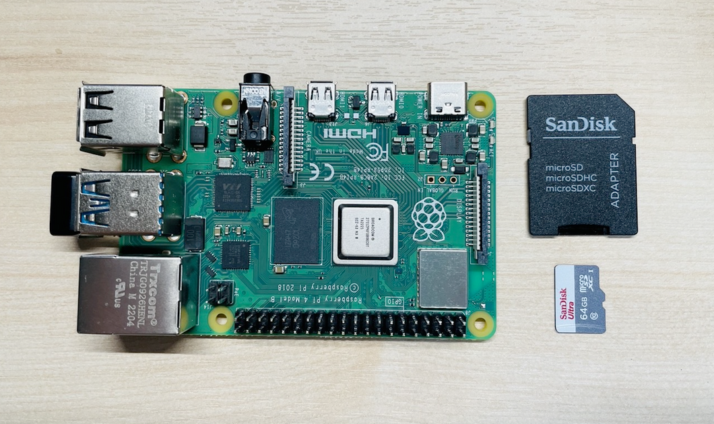
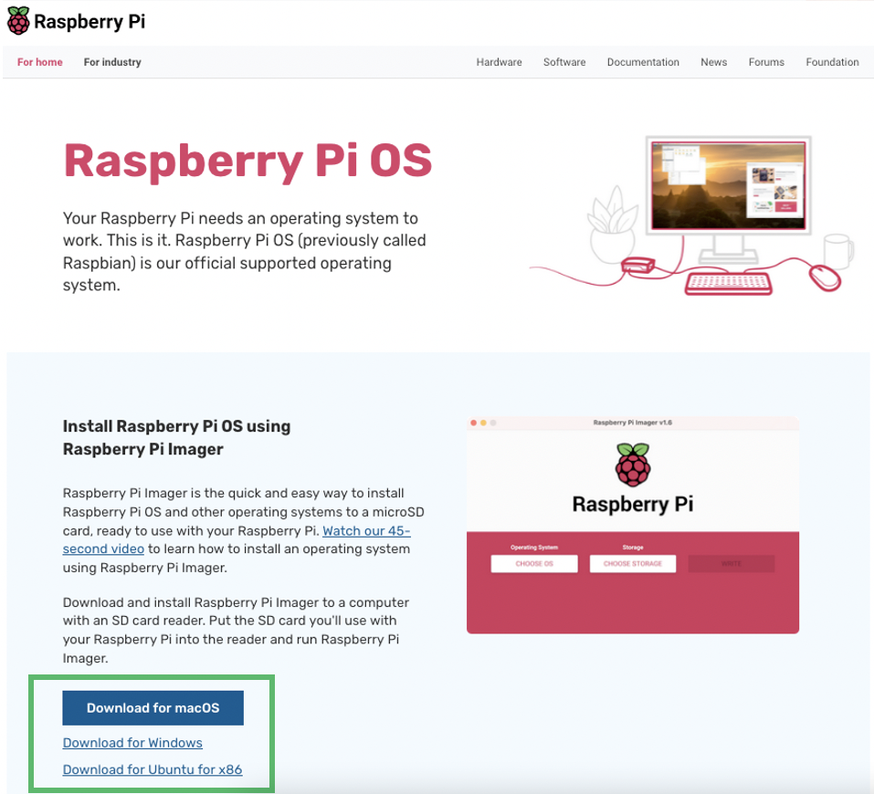
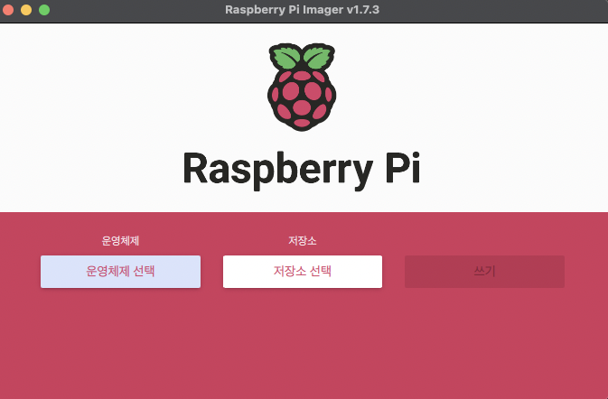
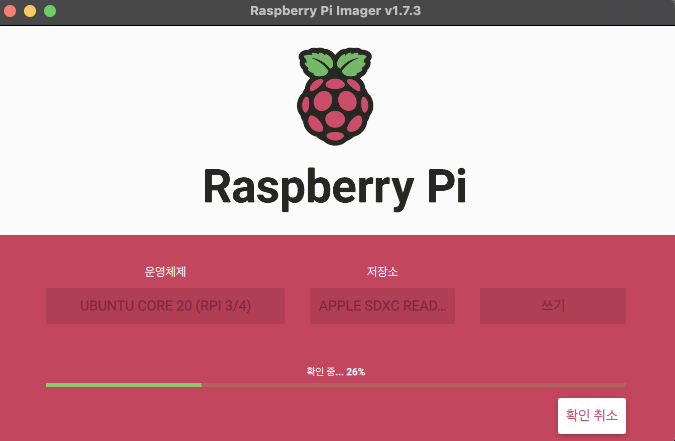
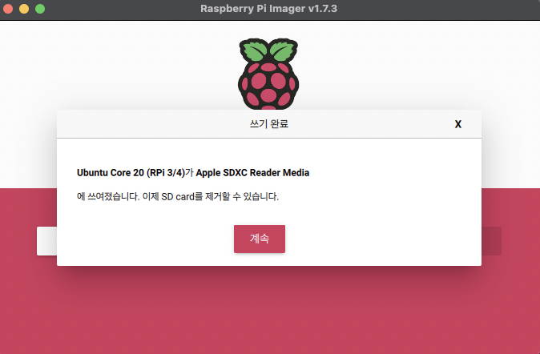
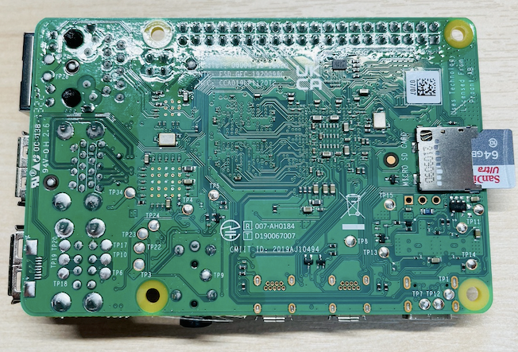
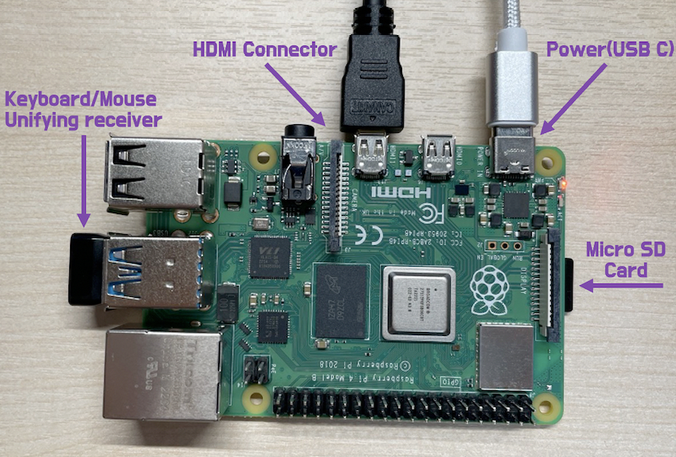
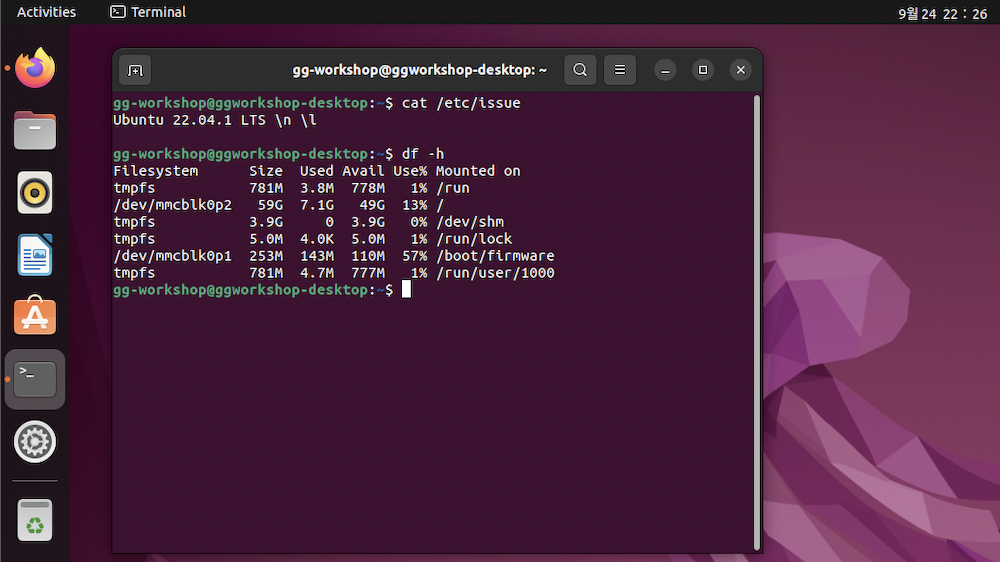
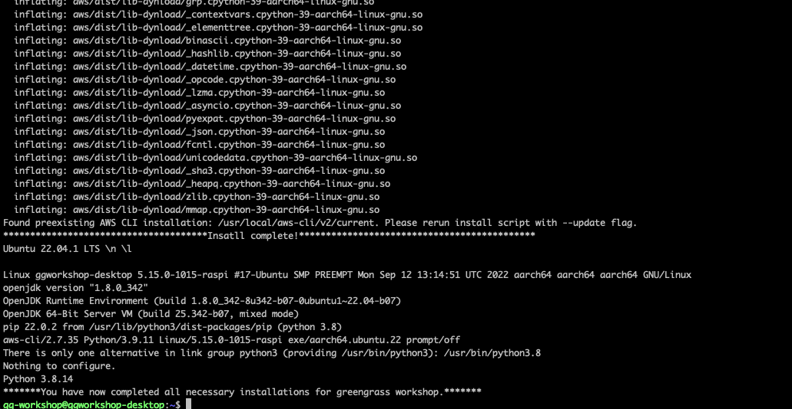

# GreengrassSetup_for_RaspberryPi
This configuration helps you use AWS Greengrass using Raspberry Pi devices.

AWS IoT Greengrass extends AWS to edge devices so that they can act on the data they generate, while they use the AWS Cloud for management, analytics, and durable storage. Install the AWS IoT Greengrass Core software on edge devices to integrate with AWS IoT Greengrass and the AWS Cloud.

이 페이지에서는 GG를 Raspberry Pi에 설치할 수 있는 환경설정을 기록 합니다.

**장치 준비:** 

라즈베리파이 본체, sd카드, sd카드 리더기, Micro HDMI Cable, 모니터, (유선)키보드, (유선)마우스, USB C Type 전원 Cable

하단 사진과 같은 라즈베리파이, sd카드, sd카드 리더기 확인



필요한 장치가 모두 준비되었다면,
준비된 디바이스에 맞는 OS 설치를 위해 먼저 [Raspberry Pi OS](https://www.raspberrypi.com/software/) https://www.raspberrypi.com/software/ 로 이동합니다.
자신의 랩탑에 맞는 ***OS Installer***를 선택 후 설치합니다.



정상적으로 설치를 마치고 실행한다면, 아래와 같은 스크린샷과 같은 **Raspberry Pi Imager 프로그램이 구동 됩니다. (Mac OS기준)**



OS 설치를 위해 다음과 같이 진행합니다.
운영체제 > Other general-purpose OS > Ubuntu Desktop 22.04.1 LTS(2022/09/25기준)

다음은 **저장소-외장 MicroSD Card**를 선택 하고 ***쓰기*** 버튼을 클릭 합니다.
**_MicroSD Card** 가 맞는지 확인해 주세요.


쓰기가 완료되면 확인 단계로 넘어가며 progress bar가 100% 될 때 까지 SD Card를 제거하지 말고 대기 합니다.



OS 쓰기작업에 대한 확인이 완료 되면 아래와 같은 완료 메시지를 확인하고 SD Card를 랩탑에서 제거 합니다.



## Raspberry Pi 에 Ubuntu OS환경설정

SD Card를 사진과 같이 **Raspberry Pi 디바이스 뒷면** 에 삽입합니다.
**_삽입 방향을 유의해주세요.



+ 준비된 입력/출력 장치를 모두 연결합니다. (키보드, 마우스, 모니터와 Micro HDMI Cable 등) 
+ 마지막으로 USB C Type 전원 Cable을 연결하여 Raspberry Pi 디바이스에 전원을 인가 합니다.



+ 모든 장치와 연결 후 Ubuntu OS의 초기 설정을 진행 합니다.
+ Ubuntu OS 계정설정을 완료 후 다음과 같이 Terminal을 열고 설치한 OS와 SD card를 체크합니다.

**OS version 체크:**
``` shell
cat /etc/issue 
```
**Disk 체크:**
``` shell
df -h 
```



**AWS IoT Greengrass 실습을 위한 Linux 환경 체크**

1. Ubuntu update
2. openjdk8버전 설치
3. glib 패키지 설치
4. PIP 설치 
5. 외부 패키지 다운로드를 위한 curl 설치
6. AWS CLI 설치
7. Git 라이브러리 설치
8. PIP 설치 후 pyinstaller 설치
9. PIP opencv 설치
10. etc(openssh, vim)

라이브러리를 직접 하나씩 설치하거나 사전에 미리 정리해 둔 간단한 명령 스크립트를 아래와 같이 다운로드 받아서 실행합니다.

실행 스크립트에는 GG를 위해 필요한 install과정이 모두 포함되어 있습니다. 

스크립트 실행 후 몇 분 정도 소요될 수 있습니다.

``` shell
cd ~
wget https://d1apwudp4l9c0h.cloudfront.net/kjhyuok/iot_tfc/ggv2_raspberry/gg_for_rbp.sh
chmod +x gg_for_rbp.sh
sudo ./gg_for_rbp.sh
```
스크립트 실행 결과 화면은 아래와 같이 확인할 수 있습니다.



**Raspberry Pi 디바이스로 AWS IoT Greengrass V2를 실습할 준비가 완료**

